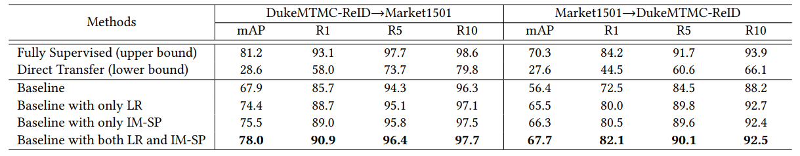

# Dual-Refinement
This is the implement for paper ***Dual-Refinement: Joint Label and Feature Refinement for Unsupervised Domain Adaptive Person Re-Identification***.


## Prerequisites

 - 4 TITAN Xp / GTX 1080ti GPUs
 - Python 3.7
 - Pytorch 1.1.0
 
```shell
git clone https://github.com/MM20Anonymous/Dual-Refinement.git
cd Dual-Refinement/
pip install -r requirements.txt
```

## Dataset

```shell
cd example && mkdir data 
```

You can download Market1501, DukeMTMC-ReID, MSMT17 from [GoogleDrive](https://drive.google.com/drive/folders/1vY3lvYgSfAbN8IEDeiNRJScENRKW7Xmk?usp=sharing)   or [BaiduYun](https://pan.baidu.com/s/1nyeaGow0luob-YJ9lsdraA) (passward: t8rm) and unzip them under the directory like

```
Dual-Refinement/examples/data
├── dukemtmc
│   └── DukeMTMC-reID
├── market1501
│   └── Market-1501-v15.09.15
└── msmt17
    └── MSMT17_V1
```
## Train
We use 4 GPUs for training.
#### 1. Source pretrain
DukeMTMC-ReIDMarket1501:
```shell
sh scripts/pretrain.sh dukemtmc market1501 1
```
Market1501DukeMTMC-ReID:
```shell
sh scripts/pretrain.sh market1501 dukemtmc 1
```
You can directly download the trained models from [GoogleDrive](https://drive.google.com/drive/folders/1vY3lvYgSfAbN8IEDeiNRJScENRKW7Xmk?usp=sharing)   or [BaiduYun](https://pan.baidu.com/s/1L4KAU37a4H50AvRUqmVq5A) (passward: jryq) and move them to the directory like

```
Dual-Refinement/logs
├── dukemtmcTOmarket1501
└── market1501TOdukemtmc
```
#### 2. Baseline train (optional)
Train with the model without the off-line label refinement and the on-line spread-out regularization.

DukeMTMC-ReIDMarket1501:
```shell
sh scripts/train_baseline.sh dukemtmc market1501 1
```
Market1501DukeMTMC-ReID:
```shell
sh scripts/train_baseline.sh market1501 dukemtmc 1
```
#### 3. Dual-Refinement train
DukeMTMC-ReIDMarket1501:
```shell
sh scripts/train_dual_refinement_duke2market.sh
```
Market1501DukeMTMC-ReID:
```shell
sh scripts/train_dual_refinement_market2duke.sh
```

## Test
We use only a GPU for testing.
```shell
sh scripts/test.sh <TARGET> <MODEL_PATH>
```
For exampl, when training on DukeMTMC-ReID and directly testing on Market1501 (lower bound on DukeMTMC-ReIDMarket1501):
```shell
sh scripts/test.sh market1501 ./logs/dukemtmcTOmarket1501/source-pretrain-1/model_best.pth.tar
```
### Evaluation on trained models
You can download the trained models from [GoogleDrive](https://drive.google.com/drive/folders/1vY3lvYgSfAbN8IEDeiNRJScENRKW7Xmk?usp=sharing)   or [BaiduYun](https://pan.baidu.com/s/1L4KAU37a4H50AvRUqmVq5A) (passward: jryq) and move them to the directory like

```
Dual-Refinement/logs
├── dukemtmcTOmarket1501
└── market1501TOdukemtmc
```
You can achieve the results of Table 2 in this paper:



For example, when evaluating the method **Baseline with both LR and IM-SP**  on DukeMTMC-ReIDMarket1501, you can run the commond like:

```shell
sh scripts/test.sh market1501 ./logs/dukemtmcTOmarket1501/Baseline_LR_IM-SP/model_best.pth.tar
```

